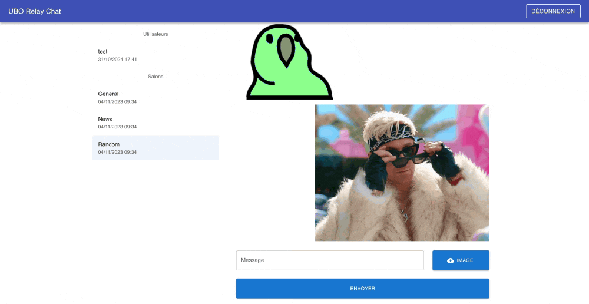

# UBO Relay Chat

## Objectifs
Créer une application de messagerie type IRC / WhatApp : [démo](https://urc.vercel.app/)

TP réalisable en binômes ; mais dans ce cas, je veux un accès au repos Git pour vérifier la contribution équitable de chacun.

Le but de ce TP est de fournir un cadre permettant l'exploration et l'expérimentation.
A vous de vous plonger dans la documentation des différents outils utilisés (Redis, Node.js, Crypto, Push API) pour comprendre leur fonctionnement et les prendre en main.
La poursuite d'idées personnelles et l'ajout de fonctionnalités additionnelles sont vivement encouragées.


## Setup

 - Installer la dernière version de Node.js depuis le [site web](https://nodejs.org/en/download) 
 - ⚠️ Les distributions Ubuntu contiennent généralement une version obsolète dans leur repos, donc la commande `apt-get install` ne permet pas de récupérer une version récente.
 - Forker le template du projet et le versionner sur Git.
 - L'intéger à [vercel](https://vercel.com/dashboard)
 - Instancier sur vercel 2 [stores](https://vercel.com/dashboard/stores) : une base de données Postgres et un cache Upstash KV (basé sur Redis)
 - Depuis l'onglet `storage` de son projet, connecter les 2 stores afin qu'ils soient accessibles par l'application
 - Vérifier dans l'onglet `Settings/Environment Variables` que toutes les infos de connexion aux stores sont bien présentes
 - Depuis l'onglet `query` de la BDD, exécuter les requêtes présentes dans le fichier [scripts/db.sql](scripts/db.sql))
 - Installer le [CLI](https://vercel.com/docs/cli) et le lier au projet local via la commande `vercel link`
 - Récupérer la configuration des DBs créées en local : `vercel env pull .env.development.local`
 - Charger les variables d'environnement : `export $(cat .env.development.local | xargs)`
 - Installer les dépendances du projet : `npm install` ou `yarn install`

Le projet peut à présent être exécuté en local, en se connectant au cache et la base de données distante, 
avec la commande `vercel dev` 🎉

La requête présente dans le fichier [scripts/db.sql](scripts/db.sql) permet d'initialiser un utilisateur `test / testubo`.
Si tout est bon, il devrait permettre de se connecter sur l'ébauche de formulaire fourni.


### Structure du projet

Le template du projet est configuré avec `Typescript`. 
Bien que son utilisation soit très vivement recommandée, elle n'est pas obligatoire. 
D'expérience, tout le temps gagné en développant en JS est perdu en cherchant des bugs qui auraient
été évités en Typescript.<br/>
Le dossier `scripts` contient une requête SQL pour créer la table `users` permettant la gestion des utilisateurs.<br/>
Le dossier `api` contient les services "back" utilisés par l'application, qui sont exécutés en tant que 
fonctions Serverless sur Vercel.

### Serverless

Vercel repose sur les services Amazon Web Services (AWS) qui constitue le principal hébergeur mondial.
La prise en main d'AWS est trop complexe et trop longue pour un TP. Heureusement, Vercel s'occupe de tout.

Au cours du setup, vous avez déjà pu créer une base de données et un cache en trois clics, 
sans avoir faire d'installation ou à gérer des composants d'infrastructure.
De la même façon, le code serveur nécessaire à l'application sera exécuté dans des conteneurs NodeJs,
instanciés à la demande, sans avoir à gérer de serveur Web.

<p>&nbsp;</p>

## La gestion des utilisateurs

### La connexion
Le squelette d'application fourni contient déjà un formulaire de connexion basique.

Le service `/api/login` permet de récupérer un token de session qu'on stocke en session storage, 
de sorte à ce qu'il soit persisté lors d'un refresh du site. <br/>
Il est présent [ici](api/login.js).<br/>
Avant de passer à la suite, lire la note sur la [gestion du mot de passe](#mdp)

Déroulé du service login : 

 - On calcule le hash du mot de passe
 - On fait un select en base pour chercher un couple username / password qui correspond
 - Si on n'en trouve pas, on renvoie une erreur
 - On met à jour la date de dernière connexion
 - On génère un token aléatoire afin d'authentifier l'utilisateur
 - On stocke ce token en cache avec une durée d'expiration de 3600s (1h)
 - On stocke les infos de l'utilisateur en cache dans une Map indexée par son identifiant (peut être utile dans la suite du TP 😉).
 - Pour finir, on retourne le token en réponse.
 - 🚨 Ce token est à enregistrer au niveau de l'application React et il devra être envoyé lors de chaque
appel API comme preuve de la connexion de l'utilisateur, sous la forme d'un header : `Authentication: Bearer le_token_reçu`.
Le fichier [lib/session.js](lib/session.js) contient une fonction `checkSession()` permettant aux services API de vérifier que l'utilisateur est bien connecté et qu'il a le droit d'appeler ce service.


### ✏️ Let's get started

- Mettre en place un store : Redux Toolkit ou Recoil (par pitié, pas de Redux sans Toolkit)
- Intégrer `React Router` et déplacer le formulaire de connexion sur une page dédiée
- Ajouter la lib UX de votre choix ([comparatif 1](https://dev.to/fredy/top-5-reactjs-ui-components-libraries-for-2023-4673),
[comparatif 2](https://www.wearedevelopers.com/magazine/best-free-react-ui-libraries#toc-5)) afin d'avoir du style ✨
- Personnaliser le formulaire de connexion pour le rendre plus attrayant


### ✏️ Ajouter de nouveaux utilisateurs

- Créer une nouvelle page et un nouveau composant avec un formulaire d'inscription contenant les champs :
login, email et mot de passe.
- S'inspirer du service login.js pour créer un service permettant d'enregistrer un nouvel utilisateur.<br/>
Celui-ci devra :
  - Contrôler que tous les champs sont bien renseignés
  - Vérifier qu'il n'existe pas déjà un utilisateur avec le même username ou le même email
  - Hasher le mot de passe
  - Générer un external_id (pour communiquer avec d'autres services, il est toujours utile d'avoir une référence utilisateur externe).
Pour ça, utiliser la même fonction que pour le token de connexion : `crypto.randomUUID().toString()`
  - Enregistrer le tout en base
- Une fois le nouvel utilisateur enregistré, vous pouvez au choix : le rediriger vers la page de connexion 
ou le connecter automatiquement pour qu'il puisse accéder directement à la messagerie.
- Bonus : mettre également en place la déconnexion

<p>&nbsp;</p>

## La messagerie

 - ✏️ Créer 3 composants (au moins), pour gérer : 
   - La liste des utilisateurs et des salons (groupes de discussion) auxquels envoyer des messages
   - La liste des message correspondant au choix précédent
   - L'état global de la messagerie


### ✏️ Liste des utilisateurs

Le service [users.js](api/users.js) permet de vérifier que l'utilisateur est bien connecté et de récupérer la liste des utilisateurs existants (avec seulement leurs données publiques).

 - Utiliser ce service pour récupérer la liste des utilisateurs et l'enregistrer dans le store
 - Afficher la liste avec le nom de chaque utilisateur et sa date de dernière connexion 
(filtrer pour ne pas afficher dans la liste l'utilisateur connecté 😁)
 - Lors de la sélection d'un utilisateur, modifier l'URL (par exemple `/messages/user/{user_id}`),
de sorte à retomber sur la bonne discussion lors d'un F5 ou de l'accès au site directement par l'URL de la conversation ciblé.
(c'est une pratique courante pour gérer les clients qui mettent les pages en favoris du navigateur).
 - Stocker dans le store la conversation sélectionnée


### Envoi d'un message

Vercel offre 2 types de Functions : les [Serverless Functions](https://vercel.com/docs/functions/serverless-functions)
qui sont exécutées dans un environnement NodeJs classique ; et les [Edge Functions](https://vercel.com/docs/functions/edge-functions)
qui tournent sur un environnement Javascript allégé (pour de meilleurs performances).
Jusqu'à présent, la version Edge suffisait ; mais pour la gestion des messages, on aura besoin de la version Serverless.

Un exemple de squelette est fourni [message.js](api/message.js) et sera à compléter.<br/>
Plusieurs différences sont à noter :

 - La Serverless Function prend en paramètre un objet `reponse` sur lequel il faut appeler les fonctions `send()` ou `json()` pour renvoyer une réponse.
 - La récupération du payload change : `await request.body;` vs `await request.json()`

<p>&nbsp;</p>

#### Enregistrement des messages

Pour la démo, j'ai choisi de stocker les messages en cache, pendant 24h, en utilisant la fonction 
Redis [LPUSH](https://vercel.com/docs/storage/vercel-kv/kv-reference#lpush).<br/>
Chaque conversation est stockée avec une clé permettant d'identifier les 2 utilisateurs concernés 
(⚠️ Si la conversion concerne les utilisateurs A et B, elle doit pouvoir être retrouvée par chacun des 2).

Si vous préférez créer une table pour stocker les conversations en base de données, libre à vous.

✏️ Compléter le service d'enregistrement de message en fonction.

<p>&nbsp;</p>

#### ✏️ Liste des messages

Lors de la sélection d'un utilisateur, afficher la liste des messages échangés avec lui.

 - Adopter un affichage type conversation avec les messages reçus alignés à gauche et ceux envoyés alignés à droite.
 - Afficher l'émetteur et la date de chaque message.
 - Bonus : ajouter de l'auto-scroll pour toujours afficher les derniers messages.


## Notifications

Pour notifier l'utilisateur de la réception d'un nouveau message et actualiser automatiquement la page,
on va utiliser le service [Pusher](https://pusher.com/)

✏️ Créer un compte Pusher et se familiariser avec la documentation.

Après la connexion ou lors de l'affichage des messages, vérifier si les notifications push sont activées
```javascript
window.Notification.requestPermission().then((permission) => {
    if (permission === 'granted') {
      // OK
    }
});
```
⚠️ Sur certains navigateurs, il faut activer les notifications manuellement. 
Sur MacOS, il faut également activer les notifications Chrome dans les paramètres de l'OS.

Instancier Pusher :
```javascript
const beamsClient = new PusherClient({
    instanceId: 'XXX',
});
```

Instancier et configurer le client :
```javascript
const beamsTokenProvider = new TokenProvider({
    url: "/api/beams",
    headers: {
        Authentication: "Bearer " + TOKEN_SESSION, // Headers your auth endpoint needs
    },
});

beamsClient.start()
    .then(() => beamsClient.addDeviceInterest('global'))
    .then(() => beamsClient.setUserId(USER_EXTERNALID, beamsTokenProvider))
    .then(() => {
        beamsClient.getDeviceId().then(deviceId => console.log("Push id : " + deviceId));
    })
    .catch(console.error);
```
Les variables `TOKEN_SESSION` et `USER_EXTERNALID` sont à remplacer en fonction de votre implémentation.

On ajoute un `DeviceInterest 'global'` qui permet de spammer tous les utilisateurs d'un coup.

Le `TokenProvider` va venir appeler le service [beams.js](api/beams.js) pour récupérer un JWT permettant d'identifier 
l'utilisateur auprès du service Pusher.

Le service `beams.js` est à adapter et à configurer pour utiliser votre instance Pusher.  
```javascript
const beamsClient = new PushNotifications({
    instanceId: process.env.PUSHER_INSTANCE_ID,
    secretKey: process.env.PUSHER_SECRET_KEY,
});
```
Les variables d'environnement Pusher sont à configurer sur votre poste et sur votre projet Vercel.
On utilise l'externalId de l'utilisateur pour l'identifier auprès du service.

Dans le service [message.js](api/message.js), envoyer une notification Push à l'utilisateur destinataire du message
```javascript
const publishResponse = await beamsClient.publishToUsers([targetUser.externalId], {
    web: {
        notification: {
            title: user.username,
            body: message.content,
            ico: "https://www.univ-brest.fr/themes/custom/ubo_parent/favicon.ico",
            deep_link: "" /* lien permettant d'ouvrir directement la conversation concernée */,
        },
        data: {
            /* additionnal data */
        }
    },
});
```

A ce stade, vous devriez recevoir les notifications Push avec 2 utilisateurs différents, connectés sur 2 navigateurs différents (ex : Chrome + Firefox).

⚠️ Les notifications Push ne fonctionneront pas avec Safari.


### Service worker

La réception de notifications Push nécessite l'enregistrement d'un `service worker`.
Il s'agit d'un fichier javascript qui tourne dans le navigateur en tâche de fond, même quand le site web n'est pas affiché.<br/>
Celui inclus dans le projet, [service-worker.js](public/service-worker.js), va appeler
la fonction `client.postMessage()` pour venir notifier notre application React de la réception d'une notification.<br/>

✏️ Mettre un composant à l'écoute du service worker :
```javascript
const sw = navigator.serviceWorker;
if (sw != null) {
    sw.onmessage = (event) => {
        console.log("Got event from sw : " + event.data);
    }
}
```
A la réception de l'événement, mettre à jour automatiquement les messages affichés.

<p>&nbsp;</p>

## Salons de discussion

Discuter à 2, c'est bien ; en groupe, c'est mieux !

- Mettre en place une table en base de données pour stocker la liste des salons 
(pas obligé de suivre le format `rooms` fourni dans le [scripts/db.sql](scripts/db.sql))
- De même que pour les utilisateurs : récupérer et afficher la liste des salons
- Permettre l'envoi d'un message sur un salon
- Afficher la liste des messages d'un salon
- Gérer les notifications push à l'ensemble des membres d'un groupe
- Ajouter un bouton pour créer un nouveau groupe
- Super bonus : gérer des groupes privés ne pouvant être consultés que par les utilisateurs autorisés par le créateur du groupe.
- Super bonus 2 : afficher le nombre de messages non lu au niveau de la liste des utilisateurs et des salons.

<p>&nbsp;</p>

## Pour les meilleurs 👑

Internet ne serait pas ce qu'il est sans les GIF !<br/>
Et ça tombe bien, en plus d'une BDD et d'un cache, Vercel propose également du stockage de fichier via les [Blobs](https://vercel.com/docs/storage/vercel-blob).

Votre dernière mission, si vous l'acceptez : ajouter la gestion des images aux conversations : 




<p>&nbsp;</p>


## Notes

<a id="mdp"></a>
### La gestion du mot de passe
Même s'il s'agit d'un TP, pour faire les choses bien, on ne stocke pas de mots de passe en clair en base de données.
La convention est d'utiliser une fonction de hashage qui permet de calculer une empreinte du mot de passe,
afin qu'il ne soit pas possible de retrouver le mot de passe initial à partir de son empreinte.<br/>
A chaque connexion, on vient re-calculer le hash du mot de passe pour le comparer avec celui enregistré en base.

Par simplicité, on utilisera ici la fonction `SHA-256` qui est nativement supportée dans l'environnement JS ;
mais celle-ci n'est plus considérée comme sécurisée et une alternative plus robuste tel que `bcrypt` serait normalement à privilégier.

2ème bonne pratique, on ne hash jamais un mot de passe seul. La concaténation avec un aléa unique
(dans le TP, il s'agit du username) permet de se prémunir des attaques de type [Rainbow table](https://fr.wikipedia.org/wiki/Rainbow_table).

Ainsi, dans l'exemple fourni dans [scripts/db.sql](scripts/db.sql), le login test / testubo se traduit
par le stockage en base de `gcrjEewWyAuYskG3dd6gFTqsC6/SKRsbTZ+g1XHDO10=`, que l'on peut vérifier avec la commande :
```bash
echo -n testtestubo | openssl sha256 -binary | base64
```


